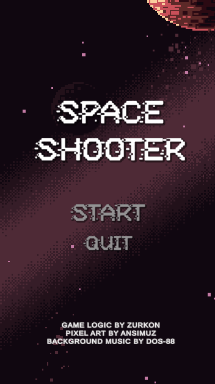

<div align="center">

# :joystick: Unity Space Shooter Game :flying_saucer:



</div>


# Setup
First of all, make sure that you have the Prerequisites to run this project on Unity.

## Prerequisites
* Unity 2019.4.13f1 or above

## Getting Started
Clone this project into your local machine or just download it:
```
git clone https://github.com/Zurkon/space-shooter.git
```
Then open the root project folder in Unity and press the Play button to run this project. :rocket:

# License
This project is licensed under the MIT License.

# Acknowledgments
* Awesome pixelart from [ansimuz](https://ansimuz.itch.io/)
* Background Music from [DOS-88 Synthwave Music Library](https://dos88.itch.io/dos-88-music-library)